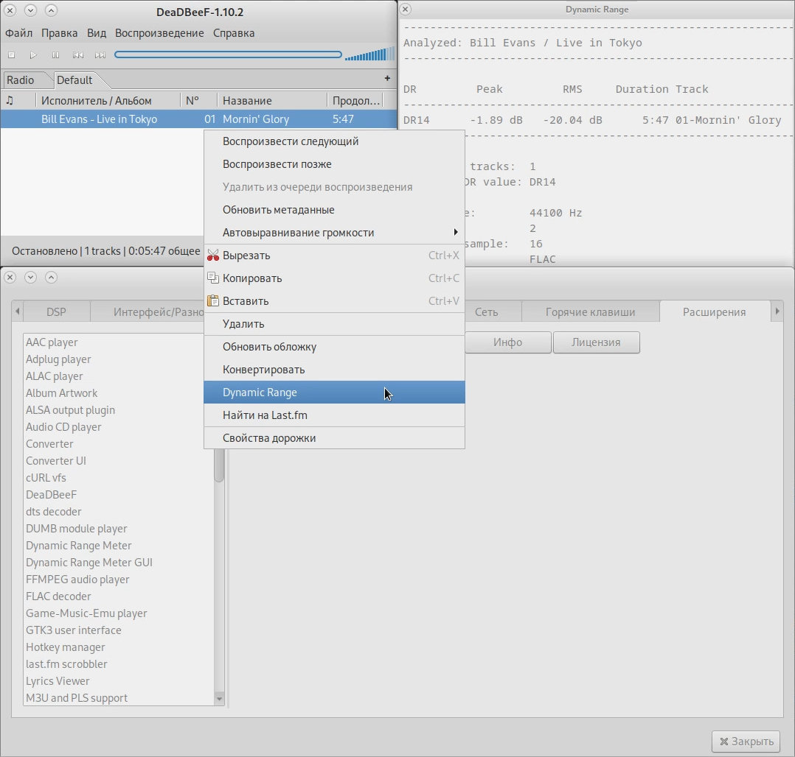

## Пакеты плагинов для проигрывателя DeaDBeeF
---------------------------------------------
DeaDBeeF Plugin Packages

## О репозитории:
-----------------

В данном репозитории мной были собраны 64-х битные установочные бинарные пакеты некоторых плагинов для аудиопроигрывателя DeaDBeeF.

**Внимание! Установочные бинарные пакеты плагинов собраны для стабильного DeaDBeeF-static установленного из deb-пакета с [официального сайта](https://deadbeef.sourceforge.io/download.html). Если вы собрали DeaDBeeF-devel из [исходников](https://github.com/DeaDBeeF-Player/deadbeef), то путь к папке с плагинами будет другим. В таком случае, [скачайте](https://deadbeef.sourceforge.io/plugins.html) и скопируйте файлы плагинов в соответстветствующую папку.**

## Содержимое:
--------------

* `deadbeef-dr-meter-linux-x86_64/99646ef/deadbeef-dr-meter_99646ef-1_amd64.deb` - 64-х битный deb-пакет плагина Dynamic Range Meter для проигрывателя DeaDBeeF для дистрибутивов на базе Debian Linux
* `deadbeef-dr-meter-linux-x86_64/99646ef/deadbeef-dr-meter-99646ef-2.x86_64.rpm` - 64-х битный rpm-пакет плагина Dynamic Range Meter для проигрывателя DeaDBeeF для дистрибутивов на базе RedHat Linux
* `deadbeef-dr-meter-linux-x86_64/99646ef/deadbeef-dr-meter-99646ef.jpg` - скриншот плагина Dynamic Range Meter для проигрывателя DeaDBeeF
* `deadbeef-dr-meter-linux-x86_64/99646ef/md5sum.txt` - контрольные суммы
* `ChangeLog` - история изменений
* `README.md` - данный файл описания

## Установка/Удаление плагинов:
-------------------------------

## Linux
--------

## Dynamic Range Meter Plugin
-----------------------------

Плагин Dynamic Range Meter для DeaDBeeF Player - выводит журнал динамического диапазона.

<p align="center"></p>

## Установка/Удаление Dynamic Range Meter Plugin с помощью пакетного менеджера:
---------------------------------------------------------------------------------

### 1.Клонируйте GitHub репозиторий wavcrc32:
```
$ cd /tmp/
$ git clone https://github.com/Konstantin-Kuney/xxxxxxx.git
```

### 2.Перейдите в папку с плагином:
```
$ cd xxxxxxxxxxx
```

### 3.Установите пакет deadbeef-dr-meter с помощью пакетного менеджера:

Debian/Ubuntu:
```
$ sudo dpkg -i deadbeef-dr-meter_99646ef-1_amd64.deb
```

RedHat/Fedora:
```
$ sudo dnf install deadbeef-dr-meter-99646ef-2.x86_64.rpm
```

### 4.Удаление deadbeef-dr-meter с помощью пакетного менеджера:

Debian/Ubuntu:
```
$ sudo apt-get purge deadbeef-dr-meter
```

RedHat/Fedora:
```
$ sudo dnf remove deadbeef-dr-meter
```

## Дополнительная информация:
-----------------------------

[Официальный сайт проигрывателя DeadBeef](https://deadbeef.sourceforge.io/)

[Плагины для проигрывателя DeadBeef](https://deadbeef.sourceforge.io/plugins.html)

[GitHub репозиторий проекта](https://github.com/DeaDBeeF-Player/deadbeef)

[Старые версии DeadBeef](https://sourceforge.net/projects/deadbeef/files/)


